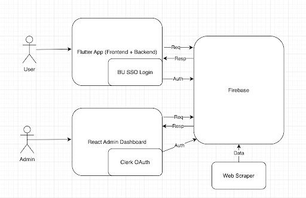

# BU Arts Passport

## Description
BU Arts Passport is a simple and lightweight mobile app that promotes and tracks student engagement in arts events hosted by the BU Arts Initiative and College of Fine Arts. 
Students can browse upcoming events, register to attend, and check in at the event to recieve points and stickers. 
Additionally, the [admin dashboard](https://github.com/BU-Spark/se-bu-passport-arts/tree/main/bu_arts_admin#readme) is a web application that allows administrators to update event information and view more detailed information about student attendance.

## Setup
### Prerequisites and Configuration
Before you begin, ensure you have met the following requirements:
- **Flutter**: Your system must have Flutter installed. This project was built using Flutter 3.19.2. Ensure that you are using this version or later. For installation instructions, see [Flutter's official installation guide](https://flutter.dev/docs/get-started/install).
- **Dart SDK**: Dart 3.3.0 or later is required. However, this typically comes with the Flutter installation.
- **Android/iOS Development**
  - Android (Any OS): Install [Android Studio](https://www.googleadservices.com/pagead/aclk?sa=L&ai=DChcSEwiJz93JkaeKAxXtRv8BHe_TBHAYABAAGgJtZA&co=1&ase=2&gclid=CjwKCAiA9vS6BhA9EiwAJpnXwyqPEeTdnmYJlmv_h0rspF6aqHx3ixG6noWUMQVLwVpKeZFgYkn7URoCgT0QAvD_BwE&ohost=www.google.com&cid=CAESVeD2u5mAw1o91c_FyY_46vP87us4vi0tA6Iu4dX6V2MuKcocLIx1gH_KQ8NA8WSIuLCQx_Rd68u3f46xv0L304_h8762XMYTJL_NxZFAJSZyI4te4ak&sig=AOD64_1eatKpc9pLRakWNLVOZIfq4CwFIg&q&nis=4&adurl&ved=2ahUKEwiYiNjJkaeKAxW4lYkEHT78HV4Q0Qx6BAgKEAE) to run the Android emulator
  - iOS (Mac only): Install Xcode in the Mac App Store to run the iPhone emulator
  - The app should be tested on both systems, so it's best to have at least one team member on each platform
- **Google Places API Key**: The Geolocation check in relies on the Google Places API, which requires an API key.
  - Create a directory under 'bu_passport/lib' named 'config'
  - Create a file named 'secrets.dart' and add your API key in this file as follows:
  ```plaintext
  final String googlePlacesApiKey=your_api_key_here;
  ```
  - The application is set up to read the API key from here, and it has already been added to the '.gitignore' file

### Installation and Usage
Recommended workflow: write code in your usual IDE (VSCode, for example), start your chosen emulator, then run the app from your IDE. The following commands should be executed from your IDE.
1. Clone into the repository
```bash
# Use either HTTPS or SSH
git clone https://github.com/BU-Spark/se-bu-passport-arts.git

cd se-bu-passport-arts/bu_passport
```

2. Install Dependencies
```bash
flutter pub get
```
Since our application is built using Flutter, the command above will download all the necessary dependencies to run the project.

3. (Mac users only) Install pod Files
Before running this app for the first time, you have to install pod files. To do this, ensure that you are in the '/ios' directory and execute the following command:
```bash
cd ios
pod install
```

4. Start your emulator

5. Run the application locally
```bash
flutter run
```

### Troubleshooting
- Pod Install Version Mismatches
  - If there are any issues with version mismatches, delete the 'podfile.lock' file and re-run the same commmand.
- Flutter dependencies installing issues or 'flutter run' issues
  - Run 'flutter clean' to clean out all dependencies for a fresh start, and re-install the dependencies and try running the app again
- Error building application for simulator or launching application
  - Re-run 'flutter run' or 'flutter clean' and restart the steps of installing and running to be extra safe

## Design Overview
### Features
- **Login and Profile**
  - Users can easily login with their BU email
  - Users can update their name, profile photo, and other personal details on their profile page
- **Event browsing**
  - Users are able to see upcoming and ongoing events either in a list view format in the explore page or in a calendar format
  - Users can search for events using specific criteria such as location, tags, and point values
- **Event Saving**
  - Users are able to save the events they are interested in, which will also be reflected onto their profile page
- **Geolocation Checkin and Photo Upload**
  - When it is the day of the event, and the user is within 400 meters to the event location, they are able to checkin and track their participation
  - Users can upload a photo while checking in to earn extra points
- **Point Tracking**
  - When a user successfully checks in to an event, they are awarded points
  - These points are saved to the user, and earning 100 points will reward them with a raffle ticket
  - There is a leaderboard page to showcase the highest raffle ticket earners
-  **Passport**
   - Certain events award users stickers for attending. They can add these stickers to their collection on the passport page

### Project Architecture



### Directory Structure

auth/ \
Handles authentication of user by checking if they are logged in or not

classes/ \
All classes will be here

components/ \
Reusable widgets such as an event_widget will be placed here
  
pages/ \
All separate pages will be under this directory

services/ \
Handle services such as queries to Firebase and geolocation from here

util/ \
Handle in-app utilities such as profile image selection here

scripts/ \
Web scraper of BU events calendar here

test/ \
All automated testing files are in this directory

### Testing
To run all the automated tests under the '/test' directory for this project, ensure that you are in the '/bu_passport' directory and execute the following command:
```bash
flutter test
```
To run a specific test file, execute the following command:
```bash
flutter test test/file_name_here.dart
```


## Future Scope

### Known Bugs
- Passport doesn't hold state -- when you leave the page, the passport resets to its blank state, removing all stickers
- Righthand page of passport can't take stickers
- Redirect to onboarding page (for collecting BUID, school, etc.) upon signup doesn't always occur on the first login
- In branch "event_filter_and_local_notification", the notification feature is not working on android devices due to dependency version issues

### Features to be Implemented
- **Interests Page**: Develop a page where students can select their interests, and see events based on their interests
- **Friends**: Develop a friends system where users can add friends, view each other's profile and passport, and invite each other to upcoming events
- **Event comments**: Allow users to comment on events in order to provide feedback to administrators
- **Privacy**: Give users the option to hide their profile from others and/or leave anonymous event comments

## Team (Fall 2024)

- Jida Li - [jidali03@bu.edu](mailto:jidali03@bu.edu)
- Yadi He - [ydhe@bu.edu](mailto:ydhe@bu.edu)
- Jaimey Frank - [jaimeyf@bu.edu](mailto:jaimeyf@bu.edu)
