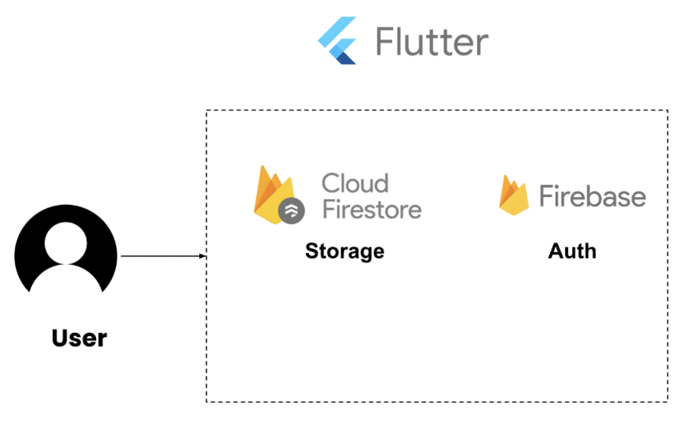

# BU Arts Passport

### Description
BU Arts Passport is a simple and lightweight mobile app that tracks student engagement in arts events hosted by the BU Arts department. 
This project aims to streamline the process of attending art events at school: starting from seeing the ongoing and upcoming events, 
finding out the details of interested events, to finally checking in and tracking the participation to these events.

### Prerequisites and Configuration
Before you begin, ensure you have met the following requirements:
- **Flutter**: Your system must have Flutter installed. This project was built using Flutter 3.19.2. Ensure that you are using this version or later. For installation instructions, see [Flutter's official installation guide](https://flutter.dev/docs/get-started/install).
- **Dart SDK**: Dart 3.3.0 or later is required. However, this typically comes with the Flutter installation.
- **Android or iOS Setup**: For Android, you must have Android SDK setup. For iOS, you need to Xcode installed to run the simulator. Ensure that these emulators are configured for your IDE of choice. For the iOS simulator, we developed using either the iPhone 14 Pro Max or iPhone 15 Pro Max. For further develop, choose either one to be safe.
- **Google Places API Key**: The Geolocation check in relies on the Google Places API, which requires an API key.
  - Create a directory under 'bu_passport/lib' named 'config'
  - Create a file named 'secrets.dart' and add your API key in this file as follows:
  ```plaintext
  final String googlePlacesApiKey=your_api_key_here;
  ```
  - The application is set up to read the API key from here, and it has already been added to the '.gitignore' file

### Installation and Usage
1. Clone into the repository
```bash
# Use either HTTPS or SSH
git clone https://github.com/BU-Spark/se-bu-passport-arts.git

cd se-bu-passport-arts/bu_passport
```

2. Install Dependencies
```bash
flutter pub get
```
Since our application is built using Flutter, the command above will download all the necessary dependencies to run the project.

3. Install pod Files
Before running this app for the first time, you have to install pod files. To do this, ensure that you are in the '/ios' directory and execute the following command:
```bash
pod install
```
Link to [Troubleshooting](#troubleshooting) for potential errors related to pod install.

4. Run the application locally
```bash
flutter run
```
Running this command will run the app locally, either via an Android simulator or iOS simulator. Ensure that you have either simulators installed and 
selected before running this command. \
Link to [Troubleshooting](#troubleshooting) for errors with running the app or missing dependencies.

### Features
- **Centralized Section for Events**
  - Users are able to see upcoming and ongoing events either in a list view format in the explore page or in a calendar format
- **Event Saving**
  - Users are able to save the events they are interested in, which will also be reflected onto their profile page
- **Geolocation Checkin**
  - When it is the day of the event, and the user is within 400 meters to the event location, they are able to checkin and track their participation
- **Point Tracking**
  - When a user successfully checks in to an event, they are awarded points
  - These points are saved to the user, and earning 100 points will reward them with a raffle ticket
  - There is a leaderboard page to showcase the highest raffle ticket earners

### Testing
To run all the automated tests under the '/test' directory for this project, ensure that you are in the '/bu_passport' directory and execute the following command:
```bash
flutter test
```
To run a specific test file, execute the following command:
```bash
flutter test test/file_name_here.dart
```

### Project Architecture



### Directory Structure

auth/ \
Handles authentication of user by checking if they are logged in or not

classes/ \
All classes will be here

components/ \
Reusable widgets such as an event_widget will be placed here
  
pages/ \
All separate pages will be under this directory

services/ \
Handle services such as queries to Firebase and geolocation from here

util/ \
Handle in-app utilities such as profile image selection here

scripts/ \
Web scraper of BU events calendar here

test/ \
All automated testing files are in this directory

### Current Known Issues, Bugs or Errors
1. [Check-in and Saved Event](https://github.com/BU-Spark/se-bu-passport-arts/issues/13)
2. [Web Scraper](https://github.com/BU-Spark/se-bu-passport-arts/issues/14)
3. [Passport](https://github.com/BU-Spark/se-bu-passport-arts/issues/15)
4. [JSON vs. ICS vs. Web Scraper](https://github.com/BU-Spark/se-bu-passport-arts/issues/16)
5. [Firebase Options API Key](https://github.com/BU-Spark/se-bu-passport-arts/issues/20)

<a name="troubleshooting"></a>
### Troubleshooting
- Pod Install Version Mismatches
  - If there are any issues with version mismatches, delete the 'podfile.lock' file and re-run the same commmand.
- Flutter dependencies installing issues or 'flutter run' issues
  - Run 'flutter clean' to clean out all dependencies for a fresh start, and re-install the dependencies and try running the app again
- Error building application for simulator or launching application
  - Re-run 'flutter run' or 'flutter clean' and restart the steps of installing and running to be extra safe

## Future Scope

### Features to be Implemented
- **Passport and Stickers**: A passport where students can decorate with stickers to showcase their participation in events
- **Reviews, Photos and Ratings for Events**: A system that allows students to express their thoughts of attended events with ratings, comments, and photos taken at the event
- **Enhancing Points System**: Add more variability in how students can earn points
- **Google/BU SSO Login**: Allow students to login using their BU credentials or Google email for authentication
- **Events Filtering**: Allow students to filter for events based on category or tags of events
- **Interests Page**: Develop a page where students can select their interests, and see events based on their interests
- **Friends**: Develop a friends system where users can add friends and view each other's progress and participation levels

### Pages that Still Need Updates
- **Profile Page**: Adding a passport and additional features that have yet to be implemented, like a friends system
- **Explore page**: Add an events filtering feature based on event tags. How the events are displayed can be changed to, for example, instead of a list view format, the events can be sorted by date, or have some events be in a horizontal scroll format.

### Additional Notes Moving Forward
- Do additional research if an admin side of the app is needed/necessary
- Work on a new method of pulling events. Currently, events are pulled using a web scraper to fetch calendar data from the BU Arts calendar website. However, this likely wouldn't be the long-term solution. JSON or ICS files are avaliable, but additional research shows that these files may not be appropriate for the use case of this project (see JSON vs. ICS document on Google Drive). 
- Find a way to generate tags for events. At the moment, BU has not generated any tags for their events. This may change in the future, but for now, a work around would be to discover a reliable method to generate tags for events. These tags are essential for implementing the interest page, event filtering page, and the passport page. Some additional insights are added to the 'JSON vs. ICS' document, but not comprehensive enough to implement a solution yet.
- Firebase Service testing is not full coverage. Methods that require to fetch a user instance are not implemented as we couldn't mock grading a new user from a mock authenticator/database. Figuring out a way to add these tests would be ideal.
