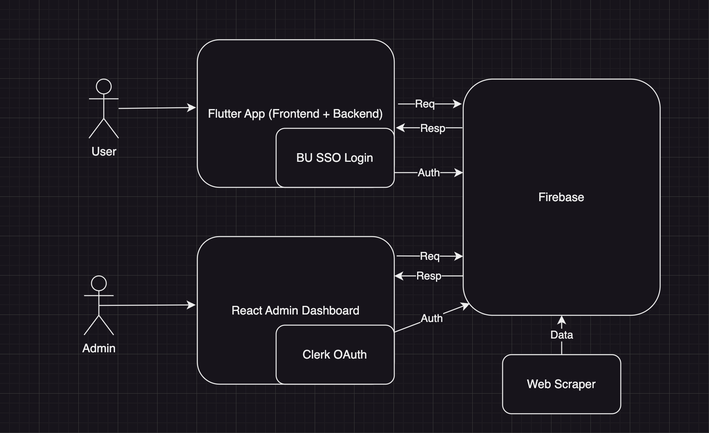

# BU Art Initiative Admin Dashboard

Through Fall 2024, our teams have been building **BU Art Initiative Admin Dashboard**. We look forward to its continued
development, ensuring that admins can view the platform statistics and manage events and users efficiently and effectively.

## Descriptions

**BU Art Initiative Admin Dashboard** is a web-based application designed to help administrators manage and oversee various aspects of the BU Art Initiative. The dashboard provides tools for viewing platform statistics, managing events, and handling user information.

## Functionalities

### 1) Sidebard and OAuth

- [x] Page routing.
- [x] Active page UI highlight.
- [x] Integration to Clerk OAuth.

### 2) Dashboard

- [x] Line chart for monthly new user counts.
- [x] Counter widget for the current month event number.

### 3) Event

- [x] Event searching based on event titles and event descriptions.
- [x] Update all fields of the upcoming event.
- [x] View past event details and its attendance.

### 4) Student

- [x] Student searching based on student name and BUID.
- [x] Student profile viewing, supporting both registered events and attended events.

## Technical Architecture



## Tech Stack

- Frontend: React.ts, Tailwind CSS, TypeScript
- Database: Firebase
- Authorization: Clerk
- DevOps Tools: Git

## Get Started

1. Go to the terminal and make sure you are in `se-bu-passport-arts/bu_arts_admin`.
2. Download dependencies:

   ```bash
    $ pnpm i
   ```

3. Create `.env` file under `se-bu-passport-arts/bu_arts_admin` and add the following varaibles:

    ```text
    PUBLIC_URL="/"
    VITE_GOOGLE_MAPS_API_KEY="key"
    VITE_FIREBASE_API_KEY="key"
    VITE_FIREBASE_AUTH_DOMAIN="domain"
    VITE_FIREBASE_DATABASE_URL="url"
    VITE_FIREBASE_PROJECT_ID="id"
    VITE_FIREBASE_STORAGE_BUCKET="bucket"
    VITE_FIREBASE_MESSAGING_SENDER_ID="id"
    VITE_FIREBASE_APP_ID="id"
    VITE_CLERK_PUBLISHABLE_KEY="key"
    ```

4. Run `pnpm run dev` and you should be ready to go.

## File Structure

```shell
se-bu-passport-arts/bu_arts_admin
.
├── README.md              # Project documentation and information
├── dist/                   # Compiled output directory
├── index.html             # Main HTML file for the application
├── public/                 # Public assets directory
├── src/                    # Source code directory
```

```shell
se-bu-passport-arts/bu_arts_admin/src
.
├── App.tsx                # Main application component that sets up routing and layout
├── assets/                 # Directory for static assets like images, fonts, etc.
├── components/             # Reusable React components used throughout the application
├── firebase/               # Firebase configuration and service files
├── index.css              # Global CSS styles for the application
├── interfaces/             # TypeScript interfaces and types used in the application
├── main.tsx               # Entry point for the React application
├── pages/                  # React components representing different pages/routes
├── utils/                  # Utility functions and helper modules
└── vite-env.d.ts          # TypeScript declaration file for Vite environment variables
```

## Known Bugs and Issues

- **View Attendance Profile**: When clicking "going back" button, the admin is redirected to the View Students Page, instead of the Event Detail Page.

## Future Work

### 1) Past Event Attendance

In the current implementation of the database. There is no clear difference between the user saved events and user registered events. Thus, how to calculate the number of the registered users of an event in the `PastEventDetailPage` remains further discussion. Meanwhile, in the `AttendancePage.tsx`, there is not an efficient way to determine absent users due to the same issue.

### 2) Student Profile

The ranking in the `ViewStudentsPage.tsx` is correctly a placeholder. The value remains further discussion with the client. For `StudentProfilePage.tsx`, how to determine the user's upcoming events is unclear due to the same reason in 3.1.

### 3) Dashboard

The current dashboard supports a line chart for new user count in different time range and a widget of the current month event counter. The additional statistics requires further discussion with the UI/UX team and the client.

### 4) Download History

The Download history page is not yet implemented. We still need to discuss with the client on the format
and the data fields and types in the download file in different cases. Meanwhile, the functionality of logging
the admin's download history is easy, but too keep allow the admin to re-download the file could introduce extra
overhead to the database.

### 5) OAuth

Currently, there is no restriction on who can login to its admin dashboard. An middleware should be implemented to ensure only the authorized user can log in.

### 6) Todo Page

Both UI and SE teams should design and implement a Todo Page. Since some newly scraped events may have missing info issues, such as zero points, incorrect geolocations, missing event categories. By engineering a Todo Page can remind admins to complete these missing info before hand.

### 7) Admin Management Page

It is suggested to have a super admin, who can add/delete admin (and set access scope if needed).

## Team

- Jida Li - [jidali03@bu.edu](mailto:jidali03@bu.edu)
- Yadi He - [ydhe@bu.edu](mailto:ydhe@bu.edu)
- Jaimey Frank - [jaimeyf@bu.edu](mailto:jaimeyf@bu.edu)
  
